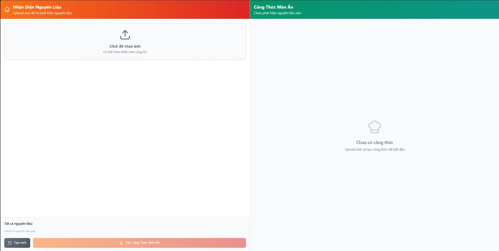
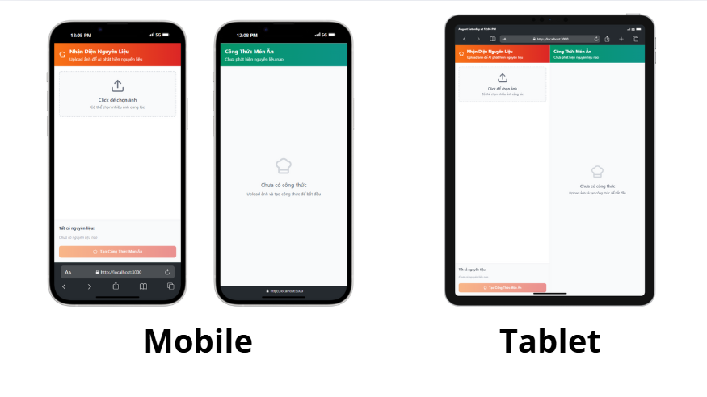
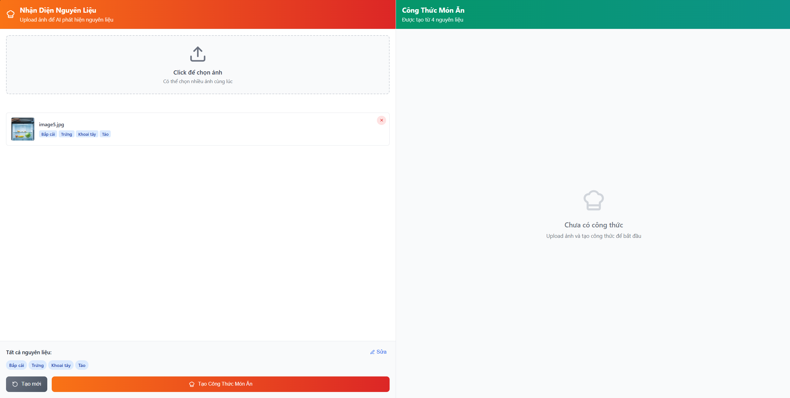
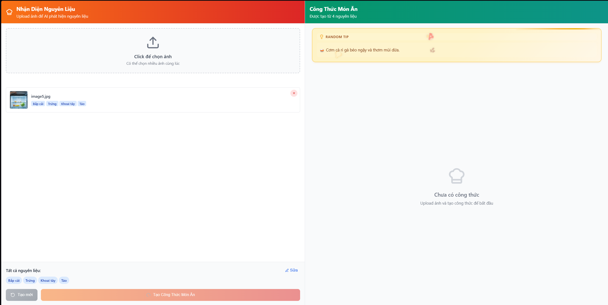
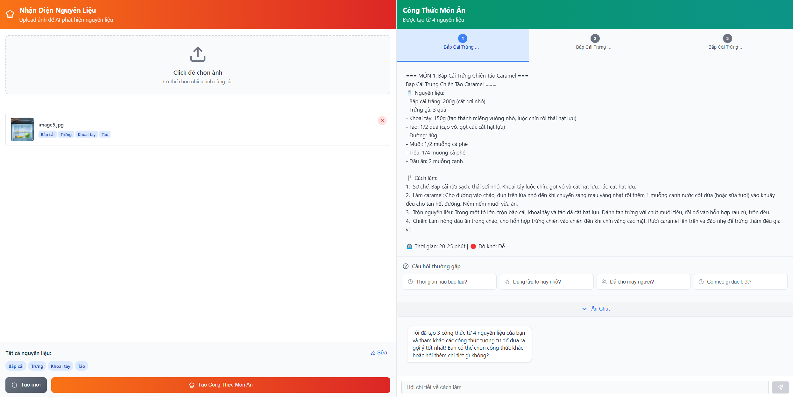

# Food Detection & Recipe Generation App - Demo

> AI-powered cooking assistant that detects ingredients from images and generates personalized recipes

## Features

### 🔍 Smart Ingredient Detection
- **YOLO AI Detection**: Upload photos to automatically identify ingredients
- **Multi-language Support**: English detection with Vietnamese translation
- **Manual Editing**: Fine-tune detected ingredients list
- **Batch Upload**: Process multiple images at once

### Intelligent Recipe Generation
- **3 Recipe Options**: Generate 3 different recipes from same ingredients
- **Vector Database**: Enhanced with similar recipe context
- **Detailed Instructions**: Step-by-step cooking guidance
- **Nutritional Info**: Cooking time, servings, and difficulty level

### Interactive Chat Assistant
- **Context-Aware**: Chat knows which recipe you're viewing
- **Recipe-Specific Sessions**: Separate conversations for each dish
- **Real-time Streaming**: Live response generation
- **Quick Questions**: Pre-defined cooking tips and FAQs

### Enhanced User Experience
- **Responsive Design**: Works on desktop, tablet, and mobile
- **Recipe Tabs**: Easy switching between multiple recipes
- **Cooking Tips**: Random tips with falling food icons animation
- **Loading Animations**: Smooth progress indicators

## Architecture

```
┌──────────────────┐    ┌─────────────────┐    ┌─────────────────┐
│   React Frontend │    │  Flask Backend  │    │   AI Services   │
│                  │    │                 │    │                 │
│ • Image Upload   │◄──►│ • YOLO Detection│◄──►│ • LM Studio     │
│ • Recipe Tabs    │    │ • Recipe Gen    │    │ • Vector DB     │
│ • Chat System    │    │ • Chat Sessions │    │ • Embeddings    │
└──────────────────┘    └─────────────────┘    └─────────────────┘
```

## Tech Stack

**Frontend**
- React 18+ with Hooks
- Pure CSS with advanced animations
- Lucide React icons
- Responsive design

**Backend** 
- Flask Python API
- YOLO v8/v9 for detection
- ChromaDB vector database
- Session management

**AI & ML**
- Local LLM via LM Studio
- Sentence Transformers for embeddings
- Custom trained YOLO model
- Vector similarity search

## Screenshots

### Main Interface



### Ingredient Detection  


### Cooking Tips


### Recipe Generation


### Chat Assistant


## Use Cases

### For Home Cooks
- Turn random ingredients into complete meals
- Get cooking advice from AI assistant
- Learn new recipes from available ingredients

### For Food Enthusiasts  
- Explore diverse cooking styles
- Understand ingredient combinations
- Improve cooking skills with tips

### For Meal Planning
- Use leftovers efficiently
- Plan meals based on available ingredients
- Reduce food waste

## Future Enhancements

### Planned Features
- [ ] **Dietary Restrictions**: Vegetarian, vegan, gluten-free options
- [ ] **Cuisine Styles**: Specific cuisine preferences (Asian, Italian, etc.)
- [ ] **Shopping Lists**: Generate ingredient shopping lists
- [ ] **Recipe Rating**: User feedback and recipe improvements
- [ ] **Social Sharing**: Share recipes with friends
- [ ] **Offline Mode**: Local recipe storage and offline access

### Technical Improvements
- [ ] **Performance**: Model optimization and caching
- [ ] **Scalability**: Docker containerization
- [ ] **Security**: Enhanced authentication and authorization
- [ ] **Testing**: Comprehensive unit and integration tests
- [ ] **Analytics**: Usage statistics and user behavior insights

## Performance Metrics

- **Detection Accuracy**: 85%+ ingredient recognition
- **Response Time**: <3s for recipe generation
- **User Satisfaction**: Based on recipe quality and relevance
- **System Uptime**: 99%+ availability target

## Contributing

This is a demo showcase of our food detection application. For the full development version and contribution guidelines, please contact the development team.

## License

This demo is for showcase purposes. Full application licensing terms apply to the complete version.

---

**🍳 Made with ❤️ by Vietnamese Developers**

*Last updated: August 2025*
